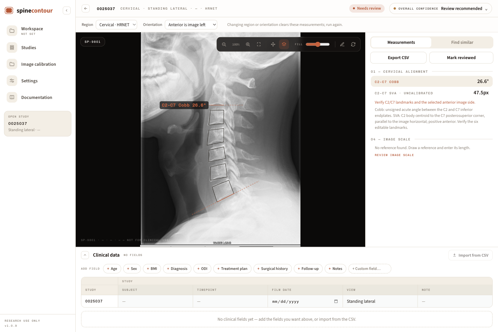
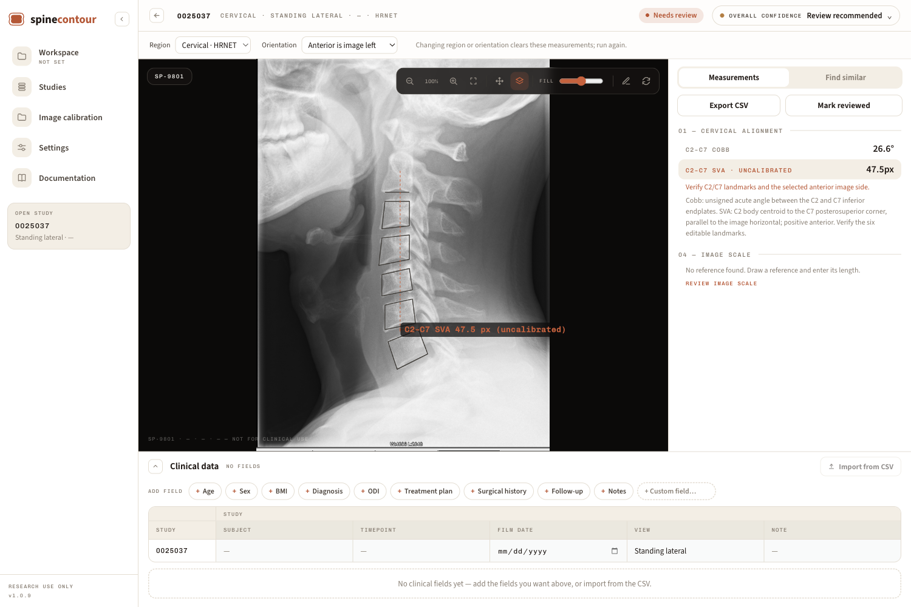

# Cervical alignment

Select **Cervical** for the study or its workspace folder and explicitly choose
whether anterior is on the image's left or right. HRNET names
image-left/image-right corners, so this choice is required to identify the C7
posterior corner. Existing studies remain lumbar unless changed deliberately.
The original image is previewed before an orientation choice is required,
including for DICOM uploads. Previewing does not create measurements.

Run the model, review the landmarks on the source image, and select a measurement
row to display its construction. The six measurement handles can be corrected;
the measurements recalculate and the corrected geometry is saved with the study.
Reset restores the original prediction. Cervical results are included in the
Parameters table and CSV exports. A missing anchor leaves its dependent value
absent; a missed detector does not trigger a whole-image landmark guess.

## Definitions and scale

- **C2–C7 Cobb:** the unsigned acute angle between the C2 inferior endplate and
  C7 inferior endplate. It does not use the C7 superior endplate and does not
  assign a lordosis/kyphosis sign.
- **C2–C7 SVA:** horizontal displacement of the C2 body centroid relative to the
  C7 superior-posterior corner. Positive means anterior displacement, according
  to the selected anterior side. The plumb line follows image acquisition
  vertical; the pipeline does not rotate the spine upright.

Without valid calibration, SVA is explicitly shown in pixels and its millimetre
value remains absent. With calibration, column spacing converts horizontal SVA
and both row and column spacing determine the physical endplate angles. A manual
scale correction or clear updates the displayed/exported measurements immediately;
old scale values in a prediction cannot override the current calibration. Detector
pixel spacing is not silently substituted for DICOM `PixelSpacing`; source
provenance remains attached to the calibration.

The model estimates landmarks; it does not establish that obscured cortex is
visible. Review C2 identity, C7 coverage, and each required cortical corner before
accepting the measurements. The cervical pipeline returns no segmentation masks.

## Model provenance

The source checkpoint is `csxa_detr_hrnet/runs/hrnet/best.pt`.

HRNET uses the W32 architecture and predicts 23 cervical landmarks from 384×384 spine crops,
using its original 96×96 heatmap argmax decoder. Its paired DETR ResNet-50 finds
the spine crop without reference annotations. Both task-specific training and
checkpoint selection use the original CSXA splits: **3,474 train, 992 validation,
497 test**. Generic pretrained model
initialization precedes CSXA fine-tuning; this is not a claim of training from
random weights. Source checkpoints and SHA-256 hashes are recorded in
[`cervical_provenance.json`](../backend/weights/cervical_provenance.json).

The detector preserves the original aspect-dependent 800/1333 resize. HRNET uses
the original expanded crop, ImageNet normalization and heatmap argmax. Returned
coordinates use the actual integer crop rectangle sampled from the source image,
avoiding the old evaluation script's subpixel discrepancy between its rounded
crop and floating inverse mapping. The displayed image retains its original
coordinate origin and dimensions. Lumbar crop-localizer and toolbar-removal
settings do not replace the cervical model's required detector or alter this frame.

## Development and packaging

```sh
git lfs pull
python -m pip install -r backend/requirements-export.txt
python tools/export_onnx.py
python -m pytest backend/tests -q
node --test test/*.test.js
```

To export only cervical models, run `python tools/export_cervical_onnx.py`.
Training checkpoints are tracked with Git LFS; generated ONNX graphs and export
metadata remain in the ignored `backend/onnx/` directory. All desktop build
workflows run the common exporter, which includes both cervical graphs.
The runtime remains ONNX-only and offline; Transformers, PyTorch and timm are
export/test dependencies. The packaged verification executes all six graphs.

The implementation checks cover independent and missing anchors, mirror
invariance with an explicitly reversed anterior side, anisotropic scale,
correction/reload/export behavior, streaming, and PyTorch/ONNX output agreement.
These are software integration checks, not a new clinical validation study.

Branch verification: **471 backend tests**, **553 renderer tests**, and **15 live
Electron checks** passed. All six ONNX graphs passed runtime shape/hash checks.
Three local CSXA test films passed native/ONNX comparison; the cervical heatmap
argmax coordinates agreed exactly. The live desktop check exercised real
inference, original preview, both constructions, centroid correction, reset,
scale apply/clear, CSV and app reload. No installer was published by this change.

With an isolated scratch-profile app running, repeat the desktop check using:

```sh
CDP_PORT=9246 node tools/smoke/smoke-cervical.mjs /path/to/cervical-test-image.png
```

The test image must face anterior to image left. The check applies a deliberately
synthetic scale to its scratch study; its output is not a clinical measurement.

## Sample desktop output

The screenshots below show HRNET running on CSXA test image `0025037.png`, with
anterior on image left. The predicted C2–C7 Cobb angle is **26.6°**, and signed
C2–C7 SVA is **47.5 px**. No physical scale is available for this PNG, so SVA is
explicitly uncalibrated. These are model predictions for review.




